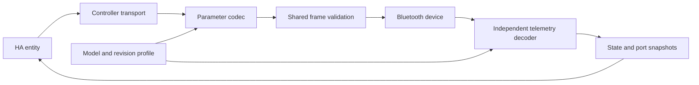

# Library and integration architecture

The standalone library owns Bluetooth, APK protocol interpretation, and device
capabilities. Home Assistant translates those capabilities into entities and owns
discovery, adapter routing, config entries, and the device registry.

## Module boundaries

Family routing is centralized so commands, telemetry and Home Assistant entities
use the same model and protocol-revision interpretation.

| Module                                     | Responsibility                                                                                                                                                      |
| ------------------------------------------ | ------------------------------------------------------------------------------------------------------------------------------------------------------------------- |
| `capabilities.py`                          | APK model catalog, family membership, known retail model numbers, and load identification                                                                           |
| `routing.py`                               | Resolve model **and protocol revision** into an immutable `ProtocolProfile`: telemetry layout, addressing, TLV width, power semantics, and root output capabilities |
| `commands.py`                              | Pure GET/SET payload encoding, TLV/ACK validation, and output-state interpretation through `ParameterCodec`                                                         |
| `protocol.py`                              | Shared command envelope, CRCs, exact length/sequence/command checks, advertisements, and compatible public packet methods                                           |
| `telemetry.py`                             | Dispatch to legacy/v6, C, H/H4, or home telemetry decoders                                                                                                          |
| `measurements.py`                          | Shared numeric wire decoding without transport dependencies                                                                                                         |
| `models.py`                                | Immutable state snapshots and port maps, device information, and normalized output discovery                                                                        |
| `device_information.py`                    | Optional GATT revision UUIDs and safe string decoding                                                                                                               |
| `device.py`                                | Connection lifetime, serialized transactions, fragmentation, independent telemetry, and confirmed state publication                                                 |
| HA `entity.py`, `metadata.py`, `output.py` | Shared entity lifecycle/errors, consistent registry metadata, and dynamic port entity discovery                                                                     |

The routing follows the APK's family boundaries without duplicating its Android
class hierarchy. A profile configures shared behavior; a decoder handles each
distinct wire layout. New families should extend the resolver and the relevant
codec/decoder, with fixtures proving their wire format. Unknown catalog-only
models remain disabled. HA platforms do not select protocol families themselves.

## Multiple outputs

`DeviceInfo.ports` holds state by protocol port ID. `DeviceInfo.outputs` returns
only recognized connected loads with usable addressing. Multiple fans, lights,
and other loads receive independent entities; actions carry their own port ID.
H4's explicit port IDs are retained rather than replaced with list indices.
Telemetry updates actual output levels independently of saved ON/OFF presets.

The original aggregate fan and sensor unique IDs remain unchanged. New entity
IDs include address, port, load kind, and control. Unplugged or changed loads make
their old entities unavailable; reconnecting the same kind reuses the entity.
The integration groups these controls under the controller's device entry. Port
identity describes a controller connection, not a globally unique load serial
number, and no load model or app-configured nickname is inferred from its kind.

## Names, revisions, and upgrades

Default discovery/config/device names include the common model name and the
advertised identity, for example `Controller 69 Pro (G-ABCDE)`. Custom config
titles and HA device registry user names are preserved. All platforms use the
same manufacturer, model name, verified model number, and Bluetooth identity.
No serial number is invented from the advertised name or Bluetooth address.

Optional Device Information reads happen during an existing connection, under the
same transaction lifetime. A five-second total deadline bounds the extra work.
A completed pass is cached for the controller's runtime; read errors can retry on
a later connection. Reloading the integration refreshes revisions. Sensors that
only advertise are not connected solely to obtain metadata.

See [protocol documentation](protocol-validation.md#device-information-revisions)
for the APK evidence distinguishing advertised protocol revision, software,
firmware, and hardware versions. The registry is updated when revisions arrive;
unknown revisions remain unknown rather than being replaced by protocol numbers.

Config schema 1.3 migrates older dataclass/dictionary identity data to JSON fields
and upgrades generated titles. It preserves custom titles, addresses, entry
unique IDs, other options, entity unique IDs, and existing Bluetooth device
matching. Registry synchronization clears the old protocol-as-firmware value and
replaces it with a real reported revision when available. No entity-ID migration
is needed because entity identifiers did not change.

## Polling and state ownership

`refresh_telemetry()` owns a bounded notification session using the same operation
lock as commands. The coordinator separately tracks 30-second telemetry freshness
and five-minute saved-settings freshness per load. Load replacement invalidates
its saved settings. Failures back off only background polling; direct commands
remain available. See [usage](usage.md#home-assistant-polling).

`DeviceInfo`, `PortState`, and revision records are immutable. Each snapshot owns
its port mapping, and `dataclasses.asdict()` remains usable for serialization.
`ControllerMode` names the APK's mode IDs. Home power remains a separate concept.
Protocol validation errors retain `ValueError` compatibility while exposing
specific frame, parameter and command-rejection subclasses.

Missing GATT characteristics trigger at most one service-cache clear/reconnect
when the backend supports it. A persistent mismatch fails after cleanup rather
than repeatedly reconnecting. Every new connection asks HA for a fresh device
route, including after service-cache recovery.
